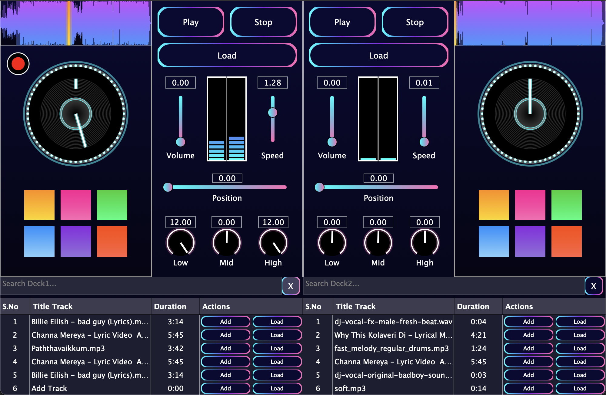

# OTO Decks

[]() [](LICENSE) []() []()

Professional DJ software featuring dual deck mixing, 3-band EQ, real-time waveform visualization, jog wheel control, drum pads, and master recording. Built with JUCE for macOS and Windows.

## Overview

OTO Decks is a feature-complete DJ mixing application designed for live performance and production. It provides professional-grade audio processing, intuitive control interfaces, and real-time visual feedback. The application demonstrates advanced audio DSP, custom UI rendering, and seamless multi-component integration.

## Main Interface



## Features

| Feature | Description |
|---------|-------------|
| **Dual Deck Mixing** | Independent playback control for two audio sources with synchronized mixing via master output |
| **3-Band EQ System** | Professional equalization (low, mid, high) using IIR filters for precise audio shaping (-24dB to +24dB per band) |
| **Real-Time Waveform** | Interactive waveform visualization with draggable playhead for intuitive seeking and position feedback |
| **Jog Wheel Control** | Simulated DJ jog wheel with drag-to-rotate mechanics for hands-on track position manipulation |
| **Drum Pads** | Six programmable pads for triggering vocal samples, bass drops, kick rolls, and beat skipping effects |
| **Special Effects** | Bass drop (frequency sweep), kick roll (repetitive hits), beat skip (forward/backward) for creative control |
| **VU Metering** | Real-time stereo volume visualization with dynamic color feedback (green → yellow → red) |
| **Playlist Management** | Add, search, filter, and load tracks with persistent library storage across sessions |
| **Master Recording** | Record mixed output as WAV file with automatic timestamped naming to desktop |
| **Drag & Drop** | Load audio files directly via file drag-and-drop or file browser selection |

## Tech Stack

- **Language:** C++11
- **Framework:** JUCE (Jules Unified Communication Engine)
- **Audio Processing:** Real-time DSP with IIR filtering
- **Platforms:** macOS (Xcode), Windows (Visual Studio)
- **Build System:** JUCE Projucer

## System Requirements

### macOS

- **macOS 10.13** or later
- **JUCE Framework:** Download from https://juce.com/download
- **Xcode:** Free from App Store or https://developer.apple.com
- **Compiler:** Clang/LLVM (included with Xcode)

### Windows

- **Windows 10** or later
- **JUCE Framework:** Download from https://juce.com/download
- **Visual Studio:** Community Edition (free) from https://visualstudio.microsoft.com
- **Windows SDK:** Included with Visual Studio installation

## Installation & Setup

### Step 1: Download & Install JUCE

1. Visit https://juce.com/download
2. Download JUCE (latest version)
3. Extract to a location on your system (e.g., `/Users/YourName/JUCE` on macOS or `C:\JUCE` on Windows)
4. Note the installation path for later

### Step 2: Download & Install IDE

**macOS:**
- Open App Store, search "Xcode", download and install

**Windows:**
- Visit https://visualstudio.microsoft.com
- Download Visual Studio Community (free)
- Run installer, select "Desktop development with C++" workload

### Step 3: Clone Repository

```bash
git clone https://github.com/naveenlabs/OTO-Decks-DJ.git
cd OTO-Decks-DJ
```

### Step 4: Configure JUCE Path

**macOS:**
1. Open `OtoDecks.jucer` with a text editor
2. Look for `<MODULEPATH>` tags
3. Update paths to point to your JUCE installation (e.g., `/Users/YourName/JUCE/modules`)
4. Save and close

**Windows:**
1. Open `OtoDecks.jucer` with a text editor
2. Look for `<MODULEPATH>` tags
3. Update paths to point to your JUCE installation (e.g., `C:\JUCE\modules`)
4. Save and close

### Step 5: Open Project

**macOS:**
```bash
open OtoDecks.jucer
```
- JUCE Projucer opens
- Click "Save and Open in IDE"
- Xcode launches automatically

**Windows:**
```bash
start OtoDecks.jucer
```
- JUCE Projucer opens
- Click "Save and Open in IDE"
- Visual Studio launches automatically

### Step 6: Build & Run

**macOS:**
1. In Xcode, select scheme: **OtoDecks** (top left)
2. Select configuration: **Debug** or **Release**
3. Press **▶ (Play)** to build and run
4. Application launches as standalone macOS app

**Windows:**
1. In Visual Studio, select configuration: **Debug** or **Release**
2. Select platform: **x64** (recommended) or **Win32**
3. Press **▶ (Play)** to build and run
4. Application launches as standalone Windows app

## Usage

### Loading Audio

- Click **Load** button on either deck
- Or drag and drop audio files directly onto the waveform display
- Supported formats: MP3, WAV, FLAC, OGG, and more

### Playback Control

- **Play** – Start playback
- **Stop** – Stop playback
- **Speed** – Adjust playback speed (0.5x to 2.0x)
- **Volume** – Control deck volume (0 to 100)
- **Position** – Seek to track position (click or drag)

### EQ Control

- **Low EQ** – Boost/cut low frequencies (120Hz)
- **Mid EQ** – Boost/cut mid frequencies (1kHz)
- **High EQ** – Boost/cut high frequencies (10kHz)
- Range: -24dB to +24dB per band

### Jog Wheel Seeking

- Click and drag jog wheel to rotate
- Visual feedback shows current position
- Smooth, responsive seeking mechanics

### Drum Pads

- **Vocal 1/2** – Load and trigger vocal samples (double-click to load)
- **Bass Drop** – Trigger 4-second frequency sweep effect
- **Kick Roll** – Trigger repetitive kick effect with amplitude decay
- **Skip Backward/Forward** – Jump by beats at current tempo

### Recording

- Toggle record button on either deck (deck 1 for master recording)
- Recorded file saved to desktop as `recording_YYYYMMDD_HHMMSS.wav`
- Blinking indicator shows active recording

### Playlist Management

- Add tracks via **Add** button in playlist
- Search tracks with text filter
- Clear filter with **X** button
- Click **Load** to load track into deck

## Implementation Details

### Audio Processing Chain

```
Audio File → Reader → Transport Source → Resampling 
→ EQ Chain (3-band IIR) → Effects (Bass Drop/Kick Roll) 
→ RMS Metering → Output Buffer → Master Mixer
```

### 3-Band EQ System

- **Low Pass:** 120Hz center frequency, Q=0.7
- **Band Pass:** 1kHz center frequency, Q=0.7
- **High Pass:** 10kHz center frequency, Q=0.7
- Real-time coefficient updates via DSP chain
- Range: -24dB to +24dB per band

### Special Effects

**Bass Drop:** 4-second frequency sweep from 120Hz to 60Hz using sine phase modulation

**Kick Roll:** Configurable repetitions of 80Hz sine wave with exponential amplitude decay (0.98 per cycle)

**Beat Skip:** Position adjustment based on beats and tempo (BPM) calculation

### Real-Time Metering

- **RMS Calculation:** Per-sample RMS computation on left/right channels
- **VU Display:** 20 blocks per channel with dynamic color (green → yellow → red)
- **Update Rate:** 50ms timer refresh

## Project Structure

```
OTO-Decks-DJ/
├── Assets/
│   └── dj-mixer-interface.png
├── Documentation/
│   ├── OOP - Report.pdf
│   └── OOP - Demonstration.mp4
├── Project/
│   ├── Source/
│   │   ├── DJAudioPlayer.h
│   │   ├── DJAudioPlayer.cpp
│   │   ├── MainComponent.h
│   │   ├── MainComponent.cpp
│   │   ├── DeckGUI.h
│   │   ├── DeckGUI.cpp
│   │   ├── WaveformDisplay.h
│   │   ├── WaveformDisplay.cpp
│   │   ├── JogWheel.h
│   │   ├── JogWheel.cpp
│   │   ├── DrumPads.h
│   │   ├── DrumPads.cpp
│   │   ├── PlaylistComponent.h
│   │   ├── PlaylistComponent.cpp
│   │   ├── VUMeter.h
│   │   ├── VUMeter.cpp
│   │   └── Main.cpp
│   └── OtoDecks.jucer
├── README.md
├── .gitignore
└── LICENSE
```

## Classes & Components

| Class | Purpose | Key Responsibilities |
|-------|---------|----------------------|
| **DJAudioPlayer** | Core audio engine | Playback control, 3-band EQ, bass drop/kick roll effects, RMS metering |
| **MainComponent** | Primary UI component | Dual deck management, audio mixing, master recording, event handling |
| **DeckGUI** | Deck interface wrapper | Integrates waveform, jog wheel, drum pads, record toggle |
| **WaveformDisplay** | Waveform renderer | Audio visualization, interactive playhead, seek callbacks |
| **JogWheel** | Virtual jog wheel | Drag-to-rotate mechanics, angle computation, position control |
| **DrumPads** | Effect pad controller | Six programmable pads, vocal samples, effect triggering |
| **PlaylistComponent** | Playlist manager | Track management, search, filtering, library persistence |
| **VUMeter** | Level visualizer | Real-time stereo metering, dynamic color feedback |

## Performance

- **Load Time:** <2 seconds for typical audio file
- **Latency:** <10ms (real-time audio processing)
- **CPU Usage:** Varies with EQ and effects (typically <5% single core)
- **Memory:** ~50-100MB depending on loaded tracks

## Documentation

Complete assignment documentation available:

- **Report:** [OOP - Report.pdf](Documentation/OOP%20-%20Report.pdf)
- **Demo Video:** [OOP - Demonstration.mp4](https://drive.google.com/file/d/1gvpTcQyfDCORx5s2V6eEtVU3k7Vv5Adu/view?usp=sharing)

## Troubleshooting

**Issue: "JUCE modules not found"**
- Solution: Verify JUCE path in `OtoDecks.jucer` matches your installation location

**Issue: "Cannot compile on Windows"**
- Solution: Ensure Visual Studio with C++ workload is installed and Windows SDK is present

**Issue: "Audio files not loading"**
- Solution: Verify file format is supported (MP3, WAV, FLAC, OGG)

## Author

**Dhanarasu Naveen**  
Computer Science (AI & Machine Learning Specialisation)  
University of London via SIM Singapore  

## License

MIT License – see [LICENSE](LICENSE) file for details.
